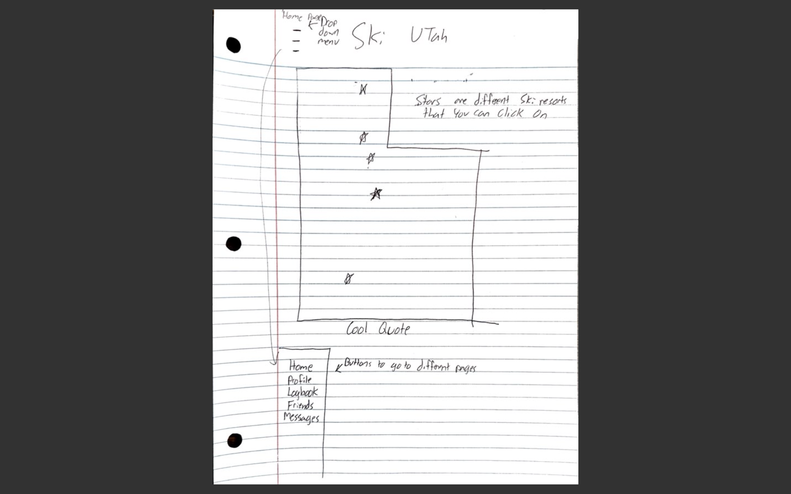
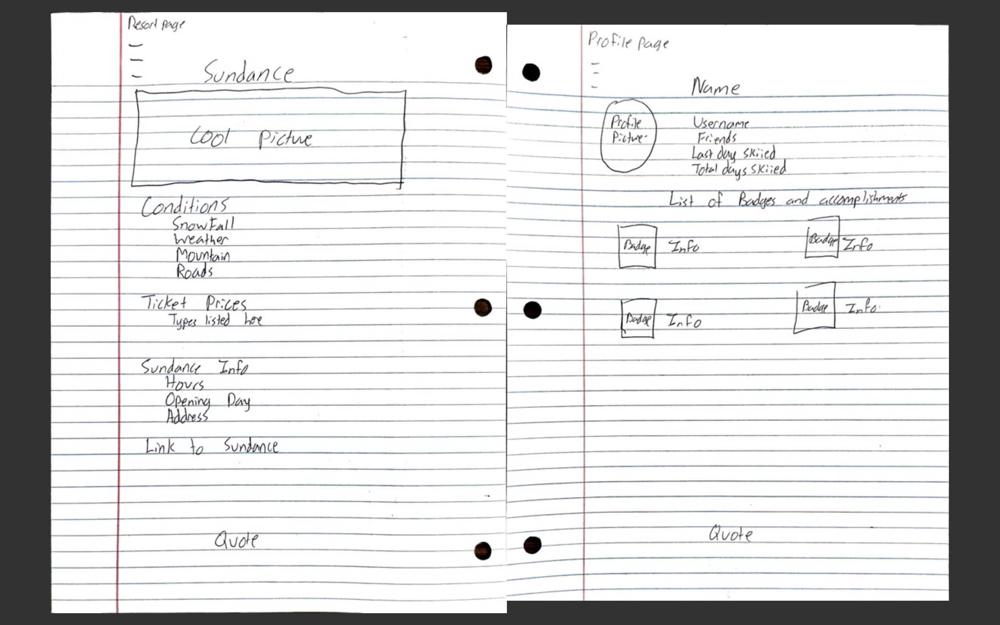
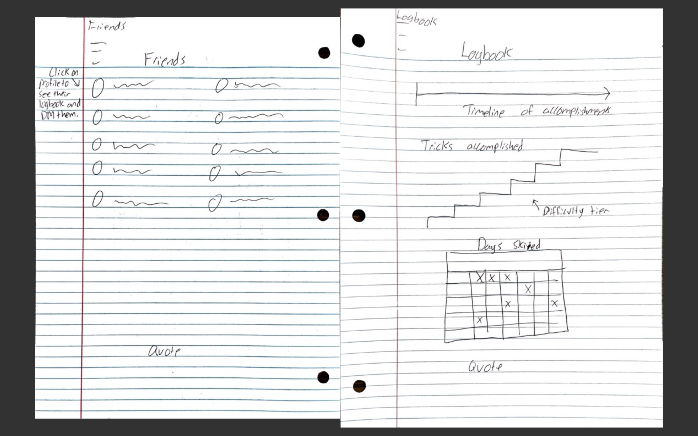

# Startup Project
## Elevator Pitch
Are you an avid skiier? Do you wish you could find all the relevant information on every ski resort in Utah: Snow reports, mountain conditions, road conditions, lift ticket prices, opening days and more? Than look no further! Ski Utah has all the information you need to have the best winter ever. Not only does Ski Utah have all the info you need but you can connect with friends, track and share progress, find new ski friends at your resort, and reach skiing milestones. Ski Utah will revolutionize the ski season. Join now!
## Key Features
- Map of Utah with all ski resorts listed with relevant information on all the resorts.
- Log book to track days you've skiied and new tricks you've landed.
- Ability to create an account, connect with other accounts, join groups, and private message other users.
- Links to all ski resorts to buy lift tickets.
## Plan to Implement Technologies
### HTML
Several HTML pages: Log in page, a map which shows all ski resorts, a page with information on each resort, a logbook to track personal progress, and a page to see fellow users and connect with them. Hyperlinks to ski resort websites.
### CSS
General style of the whole application. Good colors and cohesive fonts and allignments.
### JavaScript
Login, sharing logbook, and interactive use of the logbook and map html pages.
### React
Framework to put the application all together.
### Web service
Web services to provide weather, road, and mountain conditions. Provide winter pictures and cool quotes.
### Authentication, Database, and Login
Provides every user with login. Store logbook information and general user information.
### Websocket
Updates on logbook are shared to other user. Real time updates on snowfall and conditions.
## Rough Sketches

## HTML Deliverable; Submitted 9/28
Added original html files for each base page with placeholders for future additions. Deployed to webserver startup.jjohns-byu.click

## CSS Deliverable 10/13
- Added pictures, spacing, and design to all pages.
- Changed the design to have the login be the starting point. Also removed the login link from the navbar.
- Organized css files to have one main file and an individual file for each html page. Also linked bootstrap to each page.
- Added pictures to be the background. Added flex components. Fixed the header and footer to top and bottom.
- Changed the design to combine logbook and profile and then add a community page where you can look for friends to connect with.
- Changed the design to focus on Sundance and the people who ski there instead of all of Utah.

